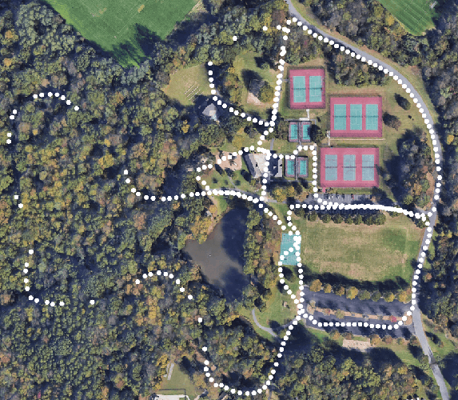

# LVI-SAM-MODIFIED

This repository is a modified version of [LVI_SAM](https://github.com/TixiaoShan/LVI-SAM).

<p align='center'>
    
</p>

---

## Modification

- Custom extrinsic parameters are adopted in the code.
- The original code assumes there are no translations among sensors. Now extrinsic parameters including the translation and rotation among IMU, Camera, LiDAR in .yaml in the ```config``` folder are correctly used.


---

## Compile

You can use the following commands to download and compile the package.

```
cd ~/catkin_ws/src
git clone https://github.com/TixiaoShan/LVI-SAM.git
cd ..
catkin_make
```

---

## Datasets

<p align='center'>
    
</p>

The datasets used in the paper can be downloaded from Google Drive. The data-gathering sensor suite includes: Velodyne VLP-16 lidar, FLIR BFS-U3-04S2M-CS camera, MicroStrain 3DM-GX5-25 IMU, and Reach RS+ GPS.

```
https://drive.google.com/drive/folders/1q2NZnsgNmezFemoxhHnrDnp1JV_bqrgV?usp=sharing
```

**Note** that the images in the provided bag files are in compressed format. So a decompression command is added at the last line of ```launch/module_sam.launch```. If your own bag records the raw image data, please comment this line out.

<p align='center'>
    
    
</p>

---

## Run the package

1. Configure parameters:

```
Configure sensor parameters in the .yaml files in the ```config``` folder.
```

2. Run the launch file:
```
roslaunch lvi_sam run.launch
```

3. Play existing bag files:
```
rosbag play handheld.bag 
```

---

## TODO

  - [ ] Update graph optimization using all three factors in imuPreintegration.cpp, simplify mapOptimization.cpp, increase system stability 

---

## Paper 

Thank you for citing our [paper](./doc/paper.pdf) if you use any of this code or datasets.

```
@inproceedings{lvisam2021shan,
  title={LVI-SAM: Tightly-coupled Lidar-Visual-Inertial Odometry via Smoothing and Mapping},
  author={Shan, Tixiao and Englot, Brendan and Ratti, Carlo and Rus Daniela},
  booktitle={IEEE International Conference on Robotics and Automation (ICRA)},
  pages={to-be-added},
  year={2021},
  organization={IEEE}
}
```

---

## Acknowledgement

  - The original version is from [LVI-SAM](https://github.com/TixiaoShan/LVI-SAM).
